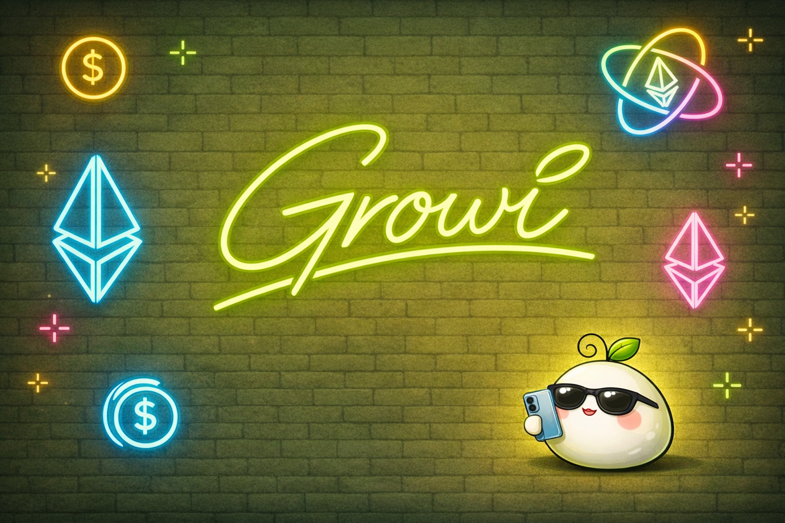
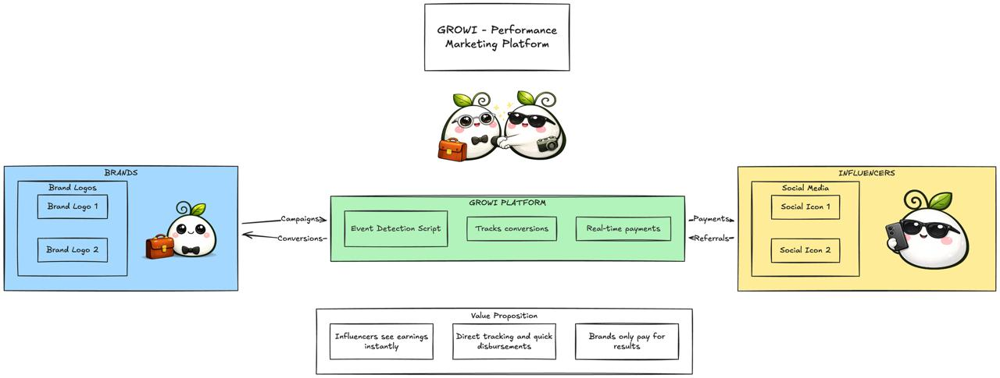

# GROWI



## Performance Marketing Platform - Connecting Brands & Influencers

Growi is a revolutionary performance marketing platform that connects brands with influencers through real-time, on-chain payments. We bridge the gap between content creators and businesses by providing transparent, instant compensation for successful conversions.



## 🚀 What We Do

Growi solves the fundamental problem of trust and delayed payments in influencer marketing:

- **For Influencers:** Share products and see your earnings reflected instantly in real-time
- **For Brands:** Only pay for actual conversions and results, not just impressions
- **For Everyone:** Complete transparency with on-chain verification

## 🎯 How It Works

1. **Influencers** share product links through their social media channels
2. **Customers** visit the brand's website through these referral links
3. **Our script** detects conversion events automatically on the brand's website
4. **Real-time payments** are triggered instantly to the influencers
5. **Brands** get more conversions while only paying for results

## 📊 Visual Diagrams

Want to see more detailed flow diagrams and technical architecture? Check out our interactive Excalidraw diagrams for a deeper dive into how Growi works under the hood.

[View Interactive Diagrams on Excalidraw →](https://excalidraw.com)

## 🔧 Technology Stack

### Yellow Network Integration
We leverage **Yellow Network** for real-time payment streaming, enabling instant payouts to influencers as soon as conversions happen.

[Learn more about our Yellow Adapter →](https://github.com/growi-buddy/hack-money-2026/tree/0605f1a5bc1b45a4adbbde2a0450b2aa35bd8972/yellow-adapter)

### ENS Verification
We use **Ethereum Name Service (ENS)** for on-chain payment verification and identity management, ensuring transparency and trust in all transactions.

[Learn more about our ENS Writer →](https://github.com/growi-buddy/hack-money-2026/tree/0605f1a5bc1b45a4adbbde2a0450b2aa35bd8972/ens-writer)

### Platform Orchestration
Our web application orchestrates the entire service, managing campaigns, tracking conversions, and coordinating real-time payments.

[Explore the Web App →](https://github.com/growi-buddy/hack-money-2026/tree/0605f1a5bc1b45a4adbbde2a0450b2aa35bd8972/web-app)

## 💡 Value Proposition

| For Influencers | For Growi | For Brands |
|----------------|-----------|------------|
| ✅ Instant earnings visibility | ✅ Automated tracking | ✅ Pay only for results |
| ✅ Transparent payments | ✅ Quick disbursements | ✅ Increased conversions |
| ✅ No payment delays | ✅ On-chain verification | ✅ Better ROI |

## 🏗️ Repository Structure

```
hack-money-2026/
├── web-app/           # Main platform orchestrator
├── yellow-adapter/    # Real-time payment streaming integration
├── ens-writer/        # On-chain verification with ENS
├── cover.png          # Brand assets
└── banner-2.jpeg      # Platform flow diagram
```

## 🌟 Key Features

- **Real-time Payment Streaming** via Yellow Network
- **On-chain Verification** using ENS
- **Automated Event Detection** with our tracking script
- **Instant Earnings Dashboard** for influencers
- **Performance Analytics** for brands
- **Zero Trust Architecture** - everything verified on-chain

## 🚀 Built for Hack Money 2026

Growi is revolutionizing performance marketing by bringing web3 technology to creator economy, making payments instant, transparent, and fair for everyone involved.

---

**Made with 💚 by the Growi team**
