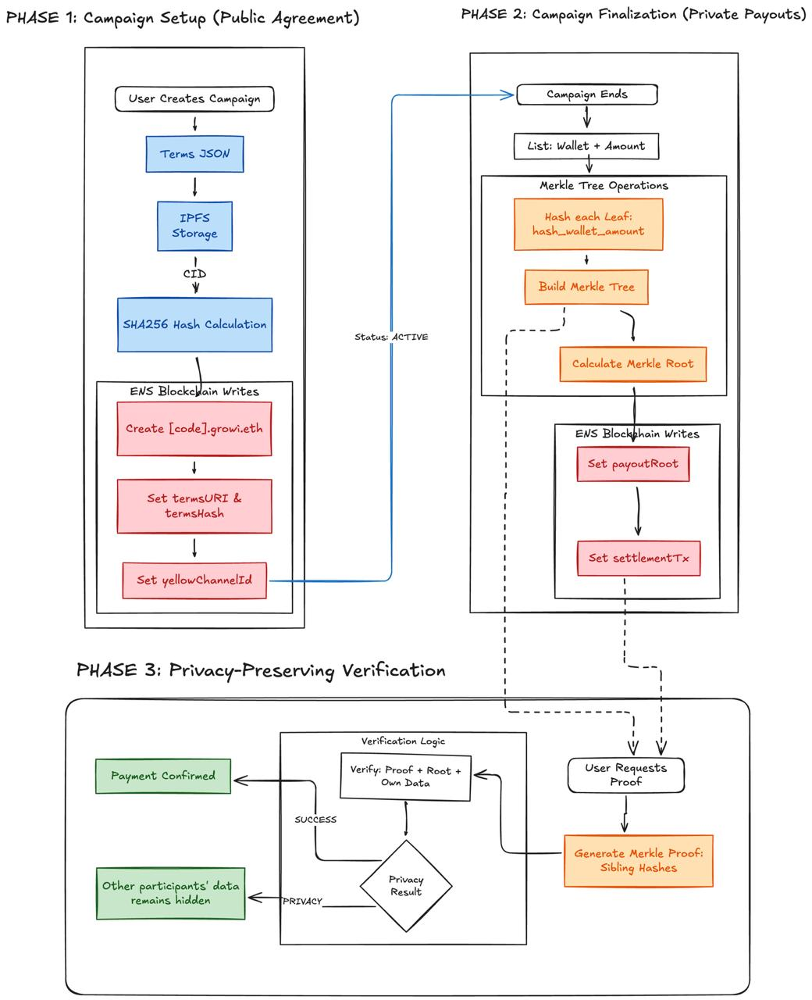

# ENS Writer 🔐

**Privacy-preserving payment verification system using ENS (Ethereum Name Service) and Merkle Trees.**

> **🌐 Live Verification Platform:** [growi-ens.vercel.app](https://growi-ens.vercel.app/)
>
> **🔗 ENS Domain (Sepolia):** [growi.eth](https://sepolia.app.ens.domains/growi.eth?tab=subnames)

---

## 📋 Table of Contents

- [What is ENS Writer?](#what-is-ens-writer)
- [The Problem We Solve](#the-problem-we-solve)
- [How It Works](#how-it-works)
- [System Architecture](#system-architecture)
- [Quick Start](#quick-start)
- [API Reference](#api-reference)
- [Testing with Postman](#testing-with-postman)
- [Tech Stack](#tech-stack)
- [Security](#security)

---

## What is ENS Writer?

ENS Writer is a backend service that manages payment campaigns using **ENS (Ethereum Name Service)** as an on-chain registry and **Merkle Trees** for privacy-preserving payment verification.

### Key Features

- 🔒 **Privacy-Preserving**: Users can verify their payments without seeing others' data
- ⛓️ **100% On-Chain**: All campaign data stored on Ethereum via ENS text records
- 🌳 **Merkle Proof Verification**: Cryptographic proofs for payment claims
- 📦 **IPFS Integration**: Decentralized storage for campaign terms via Pinata
- 🔐 **Secure API**: Authenticated endpoints with API key protection
- ✅ **Type-Safe**: Built with TypeScript and viem for Ethereum interactions

---

## The Problem We Solve

**Traditional payment systems have two major issues:**

1. **Lack of Transparency**: Recipients can't independently verify they were paid correctly
2. **Privacy Concerns**: To verify payments, you often need to expose all participants' data

**Our Solution:**

ENS Writer uses a two-phase approach:

1. **Phase 1 - Public Agreement**: Campaign terms are stored on-chain (ENS) and IPFS for full transparency
2. **Phase 2 - Private Settlement**: Payments are finalized using Merkle Trees, allowing individual verification without revealing other participants' information

---

## How It Works

### Visual Overview



### Phase 1: Campaign Setup (Public Agreement)

When you create a campaign, the following happens:

1. **Upload Terms to IPFS**
   - Campaign agreement (JSON) is uploaded to IPFS via Pinata
   - Generates a Content ID (CID): `QmXXX...`

2. **Calculate Hash**
   - SHA256 hash of the terms is calculated for integrity verification
   - Hash format: `0xYYY...` (64 hex characters)

3. **Create ENS Subdomain**
   - A subdomain is created using ENS NameWrapper
   - Example: `demo123.growi.eth`

4. **Write Text Records to ENS**
   - `growi:termsURI` → `ipfs://QmXXX` (IPFS link)
   - `growi:termsHash` → `0xYYY` (SHA256 hash)
   - `growi:yellowChannelId` → Payment channel ID

**Result**: Campaign terms are now publicly verifiable on-chain via ENS.

### Phase 2: Campaign Finalization (Private Payouts)

When the campaign ends:

1. **Collect Payouts**
   - List of payments: `[(wallet₁, amount₁), (wallet₂, amount₂), ...]`

2. **Build Merkle Tree**
   - Each leaf = `hash(wallet, amount)`
   - Uses OpenZeppelin's `StandardMerkleTree`

3. **Calculate Merkle Root**
   - Single hash representing ALL payouts
   - Root format: `0xZZZ...` (64 hex characters)

4. **Write Settlement to ENS**
   - `growi:payoutRoot` → Merkle root hash
   - `growi:settlementTx` → Settlement transaction hash

**Result**: Payments are finalized on-chain with a single hash.

### Phase 3: Privacy-Preserving Verification

Users can verify their payments:

1. **Request Merkle Proof**
   - User calls: `GET /api/ens/campaigns/{code}/proof?wallet=0x...`

2. **Generate Individual Proof**
   - System reconstructs Merkle Tree
   - Generates proof (sibling hashes path to root)

3. **Verify Payment**
   - User verifies using:
     - Their wallet + amount (only their data)
     - Merkle proof (cryptographic path)
     - Root hash from ENS (public)

**Result**: ✅ Payment verified WITHOUT revealing other participants' data!

### Why This Matters

- **Transparency**: Anyone can verify the campaign exists and has a settlement
- **Privacy**: Individual verification doesn't expose others' wallet addresses or amounts
- **Trustless**: No need to trust a third party - verify directly on blockchain
- **Efficient**: Only need to store a single hash on-chain instead of all payments

---

## System Architecture

### Tech Stack

**Backend (this repo):**
- Next.js 16 API Routes
- TypeScript
- viem (Ethereum client)
- Supabase (PostgreSQL)
- Pinata (IPFS)

**Frontend (verification platform):**
- 🌐 [growi-ens.vercel.app](https://growi-ens.vercel.app/)
- Next.js + Tailwind CSS
- ENS on-chain reading
- Merkle proof verification

### Project Structure

```
ens-writer/
├── app/api/
│   ├── ens/campaigns/              # ENS blockchain operations
│   │   ├── route.ts                # POST /api/ens/campaigns (create)
│   │   └── [code]/
│   │       ├── route.ts            # GET /api/ens/campaigns/:code (read)
│   │       ├── finalize/           # PATCH (finalize campaign)
│   │       └── proof/              # GET (generate Merkle proof)
│   ├── campaigns/                  # Supabase database operations
│   │   └── [code]/payouts/         # GET/POST payouts
│   └── health/                     # Health checks
│       ├── pinata/                 # IPFS health
│       └── supabase/               # DB health
├── lib/
│   ├── ens/                        # ENS integration
│   │   ├── subnames.ts             # Create subdomains
│   │   ├── resolver.ts             # Text records
│   │   └── abi/                    # Contract ABIs
│   ├── merkle/                     # Merkle tree operations
│   │   ├── payoutMerkle.ts         # Generate tree & root
│   │   └── verifyProof.ts          # Verify proofs
│   ├── pinata/                     # IPFS integration
│   │   ├── client.ts               # Pinata client
│   │   └── upload.ts               # Upload JSON to IPFS
│   ├── chain/                      # Blockchain config
│   │   ├── config.ts               # Chain & env vars
│   │   ├── clients.ts              # viem clients
│   │   └── tx.ts                   # Safe contract writes
│   └── ensWriter.ts                # Main logic
├── public/ens-doc.jpeg             # Architecture diagram
├── postman-collection.json         # Postman API collection
├── postman-environment.json        # Postman environment
└── EXAMPLES.md                     # API usage examples
```

---

## Quick Start

### 1. Install Dependencies

```bash
pnpm install
```

### 2. Configure Environment Variables

Copy `.env.example` to `.env` and configure:

```bash
# API Authentication
ENS_WRITER_API_KEY=your-secret-api-key-here

# Supabase (SERVER-ONLY)
SUPABASE_URL=https://your-project.supabase.co
SUPABASE_SERVICE_ROLE_KEY=your-service-role-key

# Pinata (IPFS)
PINATA_JWT=your-pinata-jwt-token

# Blockchain
ENS_WRITER_PRIVATE_KEY=0x...
RPC_URL=https://your-rpc-url
CHAIN_ID=11155111  # Sepolia testnet
ENS_ROOT_NAME=growi.eth

# ENS Contracts (Sepolia)
ENS_REGISTRY_ADDRESS=0x00000000000C2E074eC69A0dFb2997BA6C7d2e1e
NAMEWRAPPER_ADDRESS=0x0635513f179D50A207757E05759CbD106d7dFcE8
ENS_PUBLIC_RESOLVER_ADDRESS=0x8FADE66B79cC9f707aB26799354482EB93a5B7dD
```

See `BLOCKCHAIN.md` for blockchain details and `supabase/README.md` for database setup.

### 3. Setup Database (Supabase)

1. Create a project at [Supabase](https://supabase.com)
2. Go to SQL Editor and run: `supabase/schema.sql`
3. Get your `service_role` key from Settings → API
4. Update `SUPABASE_SERVICE_ROLE_KEY` in `.env`

### 4. Start Development Server

```bash
pnpm dev
```

Server runs at `http://localhost:3000`

### 5. Verify Configuration

```bash
# Test blockchain connection
pnpm test:viem

# Test Supabase connection
curl http://localhost:3000/api/health/supabase

# Test Pinata connection
curl http://localhost:3000/api/health/pinata
```

---

## API Reference

### Core Endpoints

#### 1️⃣ Create Campaign

**Endpoint:** `POST /api/ens/campaigns`

Creates a new campaign with terms stored on IPFS and ENS.

**Headers:**
```
Content-Type: application/json
x-api-key: YOUR_API_KEY
```

**Body:**
```json
{
  "code": "DEMO123",
  "campaignId": "campaign-123",
  "campaignName": "Test Campaign",
  "description": "Campaign description",
  "startDate": 1704067200,
  "endDate": 1735689600,
  "campaignManager": "manager-wallet",
  "yellowChannelId": "channel-123"
}
```

**Response:**
```json
{
  "ok": true,
  "code": "DEMO123",
  "fqdn": "demo123.growi.eth",
  "node": "0xabc...123",
  "txHashes": ["0x...", "0x..."],
  "termsURI": "ipfs://QmXXX...",
  "termsHash": "0xYYY..."
}
```

#### 2️⃣ Get Campaign

**Endpoint:** `GET /api/ens/campaigns/:code`

Reads campaign data from ENS (on-chain).

**Headers:**
```
x-api-key: YOUR_API_KEY
```

**Response:**
```json
{
  "ok": true,
  "fqdn": "demo123.growi.eth",
  "records": {
    "termsURI": "ipfs://QmXXX...",
    "termsHash": "0xYYY...",
    "yellowChannelId": "channel-123",
    "settlementTx": null,
    "payoutRoot": null
  }
}
```

#### 3️⃣ Finalize Campaign

**Endpoint:** `PATCH /api/ens/campaigns/:code/finalize`

Finalizes campaign with Merkle root of payouts.

**Headers:**
```
Content-Type: application/json
x-api-key: YOUR_API_KEY
```

**Body:**
```json
{
  "settlementTx": "0x1234567890...",
  "payouts": [
    ["0x1234567890123456789012345678901234567890", "1000000"],
    ["0x0987654321098765432109876543210987654321", "2000000"]
  ]
}
```

**Response:**
```json
{
  "ok": true,
  "code": "DEMO123",
  "fqdn": "demo123.growi.eth",
  "node": "0xabc...123",
  "txHashes": ["0x...", "0x..."],
  "payoutRoot": "0xZZZ..."
}
```

#### 4️⃣ Generate Proof

**Endpoint:** `GET /api/ens/campaigns/:code/proof?wallet=0x...`

Generates Merkle proof for a specific wallet.

**Response:**
```json
{
  "ok": true,
  "wallet": "0x1234567890123456789012345678901234567890",
  "amountMicros": "1000000",
  "proof": [
    "0xabc...",
    "0xdef...",
    "0x123..."
  ],
  "root": "0xZZZ..."
}
```

### Additional Endpoints

See `EXAMPLES.md` for complete API documentation with curl examples.

---

## Testing with Postman

We provide a complete Postman collection for testing the API.

### Import Collection

1. Open Postman
2. Import `postman-collection.json`
3. Import `postman-environment.json`

### Configure Environment

Update these variables in Postman:

- `BASE_URL`: `http://localhost:3000` (or your server URL)
- `ENS_WRITER_API_KEY`: Your API key from `.env`
- `CAMPAIGN_CODE`: Campaign code to test (e.g., `TEST123`)
- `WALLET_ADDRESS`: Test wallet address

### Available Requests

The collection includes:

**Health Checks:**
- ✅ Health Check Pinata
- ✅ Health Check Supabase

**Campaign Management:**
- 📝 Create Campaign on ENS
- 📖 Get Campaign from ENS
- 🏁 Finalize Campaign
- 🔐 Generate Proof for Wallet

**Database Operations:**
- 📋 List Campaigns by Wallet
- 💰 Get Campaign Payouts
- 💾 Upsert Campaign Payouts

**Utility:**
- 📄 Read ENS Text Record

### Example Flow in Postman

1. **Create Campaign**: Use "Create Campaign on ENS" request
2. **Wait 10-30 seconds** for blockchain confirmation
3. **Verify Campaign**: Use "Get Campaign from ENS" request
4. **Add Payouts**: Use "Upsert Campaign Payouts" request
5. **Finalize**: Use "Finalize Campaign" request
6. **Generate Proof**: Use "Generate Proof for Wallet" request

---

## Tech Stack

### Backend Technologies

- **[Next.js 16](https://nextjs.org/)** - React framework with App Router
- **[TypeScript](https://www.typescriptlang.org/)** - Type-safe development
- **[viem](https://viem.sh)** - Type-safe Ethereum client
- **[Supabase](https://supabase.com)** - PostgreSQL database (server-only)
- **[Pinata](https://pinata.cloud)** - IPFS pinning service
- **[OpenZeppelin Merkle Tree](https://github.com/OpenZeppelin/merkle-tree)** - Merkle proof generation

### Smart Contract Interactions

- **ENS Registry**: Domain ownership verification
- **ENS NameWrapper**: Subdomain creation with ERC-1155
- **ENS Public Resolver**: Text record storage

### Cryptography

- **SHA256**: Hashing campaign terms for integrity
- **Merkle Trees**: Privacy-preserving payment verification
- **keccak256**: Ethereum-standard hashing for Merkle leaves

---

## Security

### 🔒 Best Practices

✅ **DO:**
- Use environment variables for secrets (never commit `.env`)
- Keep `ENS_WRITER_PRIVATE_KEY` secure (use hardware wallet in production)
- Use `SUPABASE_SERVICE_ROLE_KEY` only in backend (bypasses Row Level Security)
- Validate all inputs before processing
- Test with testnets (Sepolia) before mainnet

❌ **DON'T:**
- Never use `NEXT_PUBLIC_*` prefix for private keys or API keys
- Never commit secrets to Git
- Never expose RPC URLs to frontend
- Never reuse the same wallet for multiple environments

### API Key Protection

All write operations require `x-api-key` header:

```bash
curl -H "x-api-key: YOUR_SECRET_KEY" \
  http://localhost:3000/api/ens/campaigns
```

### Contract Write Safety

All blockchain writes use `writeSafeContract()` which:
- Simulates transaction before sending
- Validates gas estimation
- Throws errors for failed simulations
- Prevents accidental fund loss

---

## Scripts

```bash
# Development
pnpm dev

# Production build
pnpm build

# Start production server
pnpm start

# Linting
pnpm lint

# Tests
pnpm test:viem          # Test blockchain config
pnpm test:subname       # Test ENS subdomain creation
pnpm test:records       # Test text record writing
pnpm test:verification  # Test Merkle proof verification
```

---

## Documentation

- 📘 **[EXAMPLES.md](./EXAMPLES.md)** - Complete API usage examples with curl
- ⛓️ **[BLOCKCHAIN.md](./BLOCKCHAIN.md)** - Blockchain configuration guide
- 🗄️ **[supabase/README.md](./supabase/README.md)** - Database schema and setup

---

## Verification Platform

Users can verify their payments at:

**🌐 [growi-ens.vercel.app](https://growi-ens.vercel.app/)**

The frontend allows:
- 🔍 Reading campaign data from ENS
- 📄 Fetching terms from IPFS
- ✅ Verifying payment proofs
- 🔐 Privacy-preserving verification (no backend needed)

---

## Project Status

### ✅ Completed Features

**Blockchain (ENS):**
- ✅ ENS subdomain creation with NameWrapper
- ✅ Text record writing to Public Resolver
- ✅ IPFS integration via Pinata
- ✅ SHA256 hashing for term integrity
- ✅ Idempotent operations
- ✅ Safe contract writes with simulation

**Merkle Trees:**
- ✅ Payout Merkle tree generation
- ✅ Root calculation and storage
- ✅ Individual proof generation
- ✅ On-demand proof API

**Database (Supabase):**
- ✅ Campaign management
- ✅ Payout storage and retrieval
- ✅ Health checks with schema validation

**API:**
- ✅ Complete REST API
- ✅ API key authentication
- ✅ Input validation
- ✅ Error handling
- ✅ Postman collection

### 🚧 In Progress

- 🚧 Comprehensive unit tests
- 🚧 Wallet authentication for users
- 🚧 Production deployment guide

---

## Contributing

Contributions are welcome! Please open an issue or submit a pull request.

---

## References

- [ENS Documentation](https://docs.ens.domains/)
- [viem Documentation](https://viem.sh)
- [OpenZeppelin Merkle Tree](https://github.com/OpenZeppelin/merkle-tree)
- [Pinata IPFS](https://docs.pinata.cloud/)
- [Next.js Documentation](https://nextjs.org/docs)
- [Supabase Documentation](https://supabase.com/docs)

---

## License

MIT

---

**Built with ❤️ for transparent and privacy-preserving payments**
