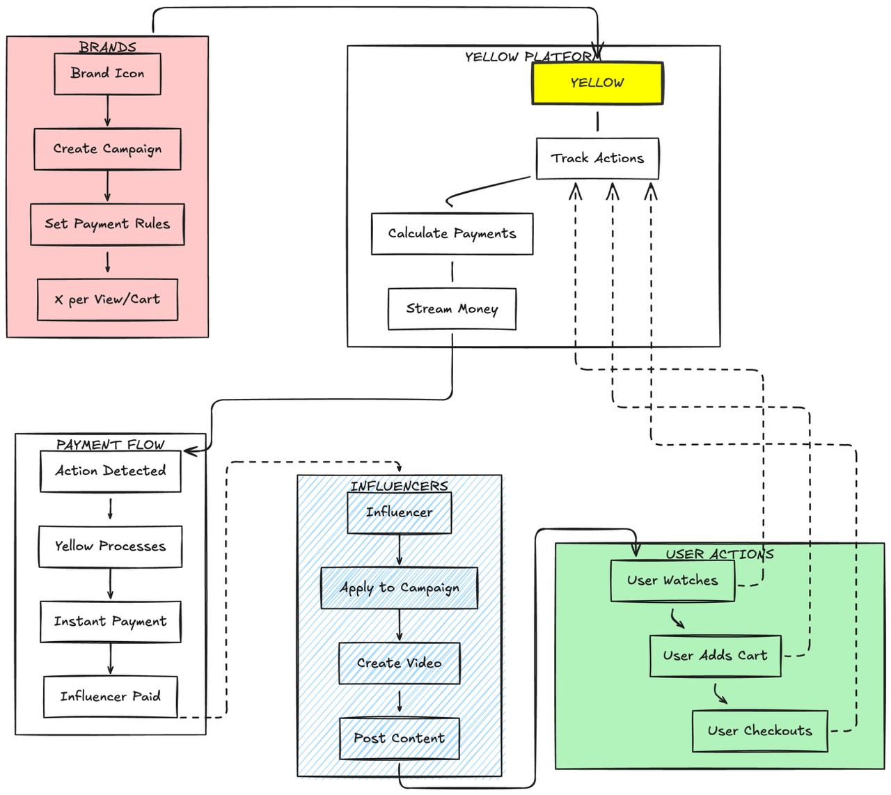

# Yellow Adapter - Real-Time Influencer Payments

## 🎯 What is Yellow?

Yellow is a **real-time payment streaming platform** that connects brands with influencers through performance-based compensation. Influencers get paid **instantly** as their content drives real results.

## 📊 How It Works



### The Flow

1. **Brands** create campaigns and set payment rules:
   - `$X` per video view
   - `$X` per add-to-cart action
   - `$X` per checkout completion

2. **Yellow Platform** acts as the central orchestrator:
   - Tracks all user actions in real-time
   - Calculates payments instantly
   - Streams money to influencers automatically

3. **Influencers** create and share content:
   - Apply to brand campaigns
   - Create engaging videos
   - Share product links with their audience

4. **Users** interact with content:
   - Watch videos
   - Add products to cart
   - Complete purchases

5. **Payment Flow** happens automatically:
   - Action detected → Yellow processes → **Instant payment** → Influencer paid

## 💡 Why Yellow is Perfect for This

### ✅ Real-Time Payment Streaming
Traditional platforms pay influencers **weeks or months** after campaigns end. Yellow pays **instantly** as actions happen. Influencers see money flowing into their wallets in real-time.

### ✅ Performance-Based Model
Brands only pay for **real results**:
- No more guessing if influencer campaigns worked
- Direct correlation between spending and conversions
- Clear ROI tracking

### ✅ Transparent & Fair
- Influencers see exactly what each action is worth
- No hidden fees or delayed payments
- Full visibility into campaign performance

### ✅ Automated Payment Infrastructure
Yellow handles all the complex parts:
- Action tracking across multiple platforms
- Automatic payment calculations
- Instant fund distribution
- No manual invoicing or payment processing needed

### ✅ Scalable for All Parties
- **Brands**: Launch campaigns and let Yellow handle everything
- **Influencers**: Focus on creating content, not chasing payments
- **Platform**: Automated system that scales effortlessly

## 🚀 Implementation

This adapter integrates Yellow's payment streaming infrastructure using:

- **@erc7824/nitrolite** - For real-time payment streaming
- **@human.tech/waap-sdk** - For action tracking and verification
- **Next.js 16** - Modern web framework
- **TypeScript** - Type-safe development

## 🔑 Key Features

- ⚡ **Instant Payments** - No waiting, no delays
- 📈 **Real-Time Analytics** - See performance as it happens
- 🎯 **Action-Based Triggers** - Pay for what matters
- 🔒 **Secure & Transparent** - All transactions verified
- 🌐 **Multi-Platform Support** - Works across different channels

## 📦 Installation

```bash
npm install
npm run dev
```

## 🌟 The Yellow Advantage

Traditional influencer marketing is broken:
- Brands don't know if campaigns are working
- Influencers wait months for payment
- No transparency in the process

**Yellow fixes this by making payments instant, transparent, and performance-based.**

When a user watches a video → Influencer gets paid  
When a user adds to cart → Influencer gets paid  
When a user checks out → Influencer gets paid  

**That's the power of Yellow.**

---

Built with Yellow's real-time payment streaming technology 🟡
